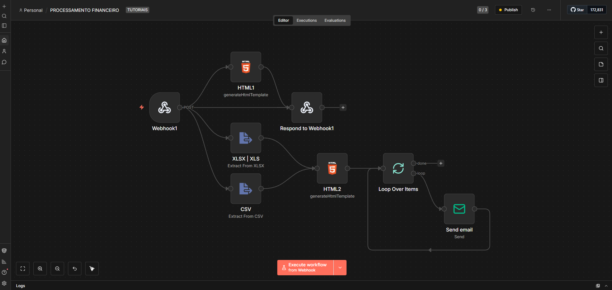

## 💵 SISTEMA DE COBRANÇA POR E-MAIL

Obs.: Esse sistema é uma réplica do projeto do canal no youtube - @andrevercosaa
ele não disponibiliza o código para copiar e colar e a pessoa laterar, tive que capturar tudo 
através do próprio vídeo, ai dexei aqui mais fácil para edição de quem quiser...A idéia dele 
é muito boa e eu precisava para ajudar minha esposa no estágio dela no processo de cobraças 
enviadas por e-mail isso ajudou muito esse processo, assim ela ganho destaque, e eu ganhei mais clientes!

## A MONTAGEM DO SISTEMA -

1 - Você vai precisar de uma VPS com n8n rodando ou um self-host como eu.
2 - Hospedagem na própria VPS ou aqui mesmo no Github, para qualquer pessoa como link acessar o sistema de cobranças.
3 - Criar uma planilha no google sheet (planilhas)


-- As colunas ficam a gosto os nomes, mas mudando os nomes precisa mudar dentro do código!

## 🧾✍️ AQUI É A IMAGEM DO WORKFLOW DO N8N E OS NODES QUE VAMOS PRECISAR

<p align="left">
  
</p>


## 🤖 O Código dá página 1 a principal
(Aqui é onde vc vai puxar e arrasta, ou busca o arquivo em CSV, XLS ou XLSX)
** esse códico vc vai copiar e colar dentro do HTML1 no n8n**
```Html
<!DOCTYPE html>
<html lang="pt-BR">
<head>
    <meta charset="utf-8"/>
    <meta content="width=device-width, initial-scale=1.0" name="viewport"/>
    <title>Processamento de Dados Financeiros</title>
    <link href="https://fonts.googleapis.com" rel="preconnect"/>
    <link crossorigin="" href="https://fonts.gstatic.com" rel="preconnect"/>
    <link href="https://fonts.googleapis.com/css2?family=Inter:wght@300;400;500;600;700&amp;display=swap" rel="stylesheet"/>
    <script src="https://cdn.jsdelivr.net/npm/sweetalert2@11"></script>

    <style>
        /* [ESTILIZAÇÃO CSS] 
           Focado em UI/UX Moderna: Uso de Backdrop-filter (efeito vidro), 
           Grades (CSS Grid) para responsividade e variáveis de cores sólidas.
        */
        * { margin: 0; padding: 0; box-sizing: border-box; }
        body {
            font-family: 'Inter', sans-serif;
            line-height: 1.6;
            color: #1f2937;
            background: #0f172a;
        }

        /* Efeito de Fundo Global com Overlay Gradiente */
        body::before {
            content: ''; position: fixed; inset: 0;
            background-image: url('https://images.pexels.com/photos/5915230/pexels-photo-5915230.jpeg?auto=compress&cs=tinysrgb&w=1260&h=750&dpr=2');
            background-size: cover; background-position: center; z-index: -2;
        }
        body::after {
            content: ''; position: fixed; inset: 0;
            background: linear-gradient(135deg, rgba(6, 95, 70, 0.9) 0%, rgba(20, 184, 166, 0.8) 50%, rgba(15, 23, 42, 0.9) 100%);
            z-index: -1;
        }

        .app-container { display: grid; grid-template-columns: 1fr 1fr; min-height: 100vh; position: relative; z-index: 1; }

        /* Hero Section: Painel de chamativa à esquerda */
        .hero-section { display: flex; align-items: center; justify-content: center; padding: 3rem 2rem; color: white; }
        .hero-title { font-size: 3rem; font-weight: 700; margin-bottom: 1.5rem; }
        .hero-title-accent { color: #10b981; }

        /* Form Section: Container do formulário à direita */
        .form-section { display: flex; align-items: center; justify-content: center; padding: 3rem 2rem; z-index: 10; }
        .upload-form { 
            background: rgba(255, 255, 255, 0.95); backdrop-filter: blur(20px);
            border-radius: 1.5rem; padding: 2rem; width: 100%; max-width: 28rem;
            box-shadow: 0 25px 50px -12px rgba(0, 0, 0, 0.25);
        }

        /* Área de Drag & Drop */
        .upload-area {
            border: 2px dashed #d1d5db; border-radius: 0.75rem; padding: 2rem;
            text-align: center; cursor: pointer; transition: all 0.2s ease;
            position: relative;
        }
        .upload-area:hover { border-color: #10b981; background: rgba(240, 253, 244, 0.9); }
        
        /* Botão de Envio com gradiente e animação */
        .submit-button {
            width: 100%; background: linear-gradient(135deg, #10b981 0%, #14b8a6 100%);
            color: white; border: none; padding: 1rem; border-radius: 0.75rem;
            font-weight: 600; cursor: pointer; transition: all 0.2s;
        }
        .submit-button:disabled { opacity: 0.5; cursor: not-allowed; }

        /* Classes de Erro e Listagem */
        .error-message { color: #ef4444; font-size: 0.875rem; display: none; margin-top: 0.5rem; }
        .error-message.show { display: block; }
        .file-item { display: flex; justify-content: space-between; padding: 0.5rem; border-bottom: 1px solid #eee; }

        /* Responsividade para Tablets e Celulares */
        @media (max-width: 1024px) { .app-container { grid-template-columns: 1fr; } }
    </style>
</head>
<body>

<div class="app-container">
    <div class="hero-section">
        <div class="hero-content">
            <h1 class="hero-title">Processamento <span class="hero-title-accent">Financeiro</span> Inteligente</h1>
            <p class="hero-description">Envie de maneira rápida solicitações de pagamentos por email</p>
        </div>
    </div>

    <div class="form-section">
        <div class="form-container">
            <form class="upload-form" id="uploadForm">
                <div class="form-header">
                    <h2 class="form-title">Envie seus Dados</h2>
                    <p class="form-subtitle">Faça upload dos arquivos e receba a planilha formatada por email</p>
                </div>

                <div class="input-group">
                    <label class="input-label" for="email">Email para Recebimento</label>
                    <input class="form-input" id="email" name="email" placeholder="seu@email.com" required type="email"/>
                    <div class="error-message" id="emailError"></div>
                </div>

                <div class="input-group">
                    <label class="input-label">Arquivos de Dados</label>
                    <div class="upload-area" id="uploadArea">
                        <div class="upload-text">Clique ou arraste seus arquivos aqui</div>
                        <div class="upload-subtext">CSV, XLS, XLSX</div>
                        <input accept=".csv,.xls,.xlsx" class="file-input" id="fileInput" multiple name="files[]" type="file" style="position: absolute; inset: 0; opacity: 0; cursor: pointer;"/>
                    </div>
                    <div class="error-message" id="fileError"></div>
                </div>

                <div class="file-list" id="fileList" style="display: none;">
                    <h3 class="file-list-title">Arquivos Selecionados (<span id="fileCount">0</span>)</h3>
                    <div class="file-items" id="fileItems"></div>
                </div>

                <div class="input-group">
                    <label class="input-label" for="automation">Automação Financeira</label>
                    <select class="form-input" id="automation" name="automation" required style="width: 100%; padding: 0.75rem; border-radius: 0.75rem; border: 1px solid #d1d5db;">
                        <option value="">Selecione uma opção</option>
                        <option value="emissao_boletos">Cobrança de inadimplentes</option>
                        <option value="fluxo_de_caixa">Projeção de Fluxo de Caixa</option>
                    </select>
                </div>

                <button class="submit-button" disabled id="submitButton" type="submit">
                    <span class="button-text">Processar Dados</span>
                    <div class="loading-spinner" style="display: none; justify-content: center; gap: 8px;">
                        <span>Processando...</span>
                    </div>
                </button>
            </form>
        </div>
    </div>
</div>


<script>
/**
 * CLASSE FileUploadApp
 * Gerencia toda a lógica de interface, validação de arquivos e
 * comunicação assíncrona com o Webhook (n8n).
 */
class FileUploadApp {
    constructor() {
        this.files = []; // Armazena os objetos File selecionados
        this.initializeElements();
        this.bindEvents();
    }

    // Seleciona os elementos do DOM para manipular via JS
    initializeElements() {
        this.uploadArea = document.getElementById('uploadArea');
        this.fileInput = document.getElementById('fileInput');
        this.emailInput = document.getElementById('email');
        this.fileList = document.getElementById('fileList');
        this.fileItems = document.getElementById('fileItems');
        this.fileCount = document.getElementById('fileCount');
        this.submitButton = document.getElementById('submitButton');
        this.uploadForm = document.getElementById('uploadForm');
        this.buttonText = this.submitButton.querySelector('.button-text');
        this.loadingSpinner = this.submitButton.querySelector('.loading-spinner');
    }

    // Registra os Event Listeners (Ouvintes de Ação)
    bindEvents() {
        // Aciona o seletor de arquivos ao clicar na área tracejada
        this.uploadArea.addEventListener('click', () => this.fileInput.click());
        this.fileInput.addEventListener('change', (e) => this.handleFileSelect(e));
        
        // Eventos de Drag & Drop (Arrastar e Soltar)
        this.uploadArea.addEventListener('dragover', (e) => { e.preventDefault(); this.uploadArea.classList.add('dragover'); });
        this.uploadArea.addEventListener('dragleave', () => this.uploadArea.classList.remove('dragover'));
        this.uploadArea.addEventListener('drop', (e) => this.handleDrop(e));
        
        this.emailInput.addEventListener('input', () => this.updateSubmitButton());
        this.uploadForm.addEventListener('submit', (e) => this.handleSubmit(e));
    }

    // Validação de Extensões Permitidas
    isValidFileType(file) {
        const validExtensions = ['.csv', '.xls', '.xlsx'];
        return validExtensions.some(ext => file.name.toLowerCase().endsWith(ext));
    }

    handleDrop(event) {
        event.preventDefault();
        this.uploadArea.classList.remove('dragover');
        this.processFiles(event.dataTransfer.files);
    }

    handleFileSelect(event) {
        this.processFiles(event.target.files);
    }

    /**
     * PROCESSA E VALIDA OS ARQUIVOS
     * Filtra arquivos duplicados e valida extensões antes de adicionar à lista oficial.
     */
    processFiles(fileList) {
        const newFiles = Array.from(fileList);
        newFiles.forEach(file => {
            if (this.isValidFileType(file)) {
                const isDuplicate = this.files.some(f => f.file.name === file.name && f.file.size === file.size);
                if (!isDuplicate) {
                    this.files.push({ file: file, id: Math.random().toString(36).substr(2, 9) });
                }
            }
        });
        this.updateFileList();
        this.updateSubmitButton();
    }

    // Renderiza a lista de arquivos na tela com botão de remover
    updateFileList() {
        this.fileList.style.display = this.files.length > 0 ? 'block' : 'none';
        this.fileCount.textContent = this.files.length;
        this.fileItems.innerHTML = '';
        
        this.files.forEach((fileItem, index) => {
            const div = document.createElement('div');
            div.className = 'file-item';
            div.innerHTML = `<span>${fileItem.file.name}</span><button type="button" class="remove-button" style="color:red; border:none; background:none; cursor:pointer;">Remover</button>`;
            div.querySelector('.remove-button').onclick = () => { this.files.splice(index, 1); this.updateFileList(); this.updateSubmitButton(); };
            this.fileItems.appendChild(div);
        });
    }

    updateSubmitButton() {
        const emailValid = /^[^\s@]+@[^\s@]+\.[^\s@]+$/.test(this.emailInput.value);
        this.submitButton.disabled = !(emailValid && this.files.length > 0);
    }

    /**
     * ENVIO DOS DADOS (SUBMIT)
     * Utiliza a Fetch API com FormData para enviar os arquivos binários
     * para o servidor de automação (Webhook).
     */
    async handleSubmit(event) {
        event.preventDefault();
        this.setLoadingState(true);

        try {
            const formData = new FormData();
            this.files.forEach(item => formData.append('files[]', item.file));
            formData.append('email', this.emailInput.value.trim());
            formData.append('automation', document.getElementById('automation').value);

            // Chamada para o Webhook do n8n
            const response = await fetch('https://n8n.maxlabinformatica.com.br/webhook/fin', {
                method: 'POST',
                body: formData // O navegador define automaticamente o Content-Type como multipart/form-data
            });

            if (response.ok) {
                Swal.fire('Sucesso!', 'Arquivos enviados. Verifique seu email em instantes.', 'success');
                this.resetForm();
            } else {
                throw new Error();
            }
        } catch (error) {
            Swal.fire('Erro', 'Não foi possível processar os dados agora.', 'error');
        } finally {
            this.setLoadingState(false);
        }
    }

    setLoadingState(isLoading) {
        this.buttonText.style.display = isLoading ? 'none' : 'block';
        this.loadingSpinner.style.display = isLoading ? 'flex' : 'none';
        this.submitButton.disabled = isLoading;
    }

    resetForm() {
        this.files = [];
        this.uploadForm.reset();
        this.updateFileList();
        this.updateSubmitButton();
    }
}

// Inicializa a aplicação assim que a estrutura da página (DOM) estiver pronta
document.addEventListener('DOMContentLoaded', () => new FileUploadApp());
</script>
</body>
</html>

```

## 🤖 O Código de como vai chegar no email da pessoa cobrada.
** esse códico vc vai copiar e colar dentro do HTML2 no n8n**
```Html
<!DOCTYPE html>
<html lang="pt-BR">
<head>
<meta charset="UTF-8">
<title>Lembrete de Pagamento</title>
<meta name="viewport" content="width=device-width, initial-scale=1.0">

<style>
@import url('https://fonts.googleapis.com/css2?family=Inter:wght@400;500;600;700&display=swap');

* {
  margin: 0;
  padding: 0;
  box-sizing: border-box;
}

body {
  font-family: 'Inter', sans-serif;
  background: #f1f5f9;
  padding: 20px;
  color: #1a202c;
}

.email-container {
  max-width: 650px;
  margin: auto;
  background: #ffffff;
  border-radius: 20px;
  overflow: hidden;
  box-shadow: 0 15px 40px rgba(0,0,0,0.12);
}

/* HEADER */
.header {
  background: #f8fafc;
  padding: 40px;
  text-align: center;
}

.greeting {
  font-size: 26px;
  font-weight: 700;
}

.subtitle {
  margin-top: 10px;
  color: #475569;
}

/* CONTENT */
.content {
  padding: 40px;
}

.intro-text {
  font-size: 16px;
  color: #374151;
  margin-bottom: 30px;
}

/* CARD */
.payment-card {
  border: 2px solid #e5e7eb;
  border-radius: 16px;
  padding: 30px;
  background: #fafafa;
}

.payment-details {
  display: grid;
  grid-template-columns: 1fr 1fr;
  gap: 20px;
}

.detail-label {
  font-size: 13px;
  font-weight: 600;
  color: #6b7280;
  text-transform: uppercase;
}

.detail-value {
  font-size: 16px;
  font-weight: 600;
  margin-top: 5px;
}

.amount {
  grid-column: 1 / -1;
  text-align: center;
  margin-top: 20px;
  padding-top: 20px;
  border-top: 1px solid #e5e7eb;
}

.amount .detail-value {
  font-size: 26px;
  font-weight: 700;
  color: #dc2626;
}

/* NOTICE */
.notice-text {
  margin-top: 25px;
  font-size: 15px;
  color: #374151;
  text-align: center;
}

/* SUPPORT */
.support-text {
  margin-top: 30px;
  font-size: 15px;
  text-align: center;
  color: #374151;
}

/* FOOTER */
.footer {
  background: #f8fafc;
  padding: 30px;
  text-align: center;
  border-top: 1px solid #e5e7eb;
}

.company-info {
  font-size: 14px;
  color: #6b7280;
}

.company-name {
  font-weight: 600;
  color: #374151;
  margin-bottom: 8px;
}

/* RESPONSIVO */
@media (max-width: 640px) {
  .payment-details {
    grid-template-columns: 1fr;
  }
}
</style>
</head>

<body>

<div class="email-container">

  <div class="header">
    <h1 class="greeting">Olá, {{ $json["Nome do Cliente"] }}</h1>
    <p class="subtitle">Temos uma pendência para resolver juntos</p>
  </div>

  <div class="content">

    <p class="intro-text">
      Identificamos um pagamento pendente em sua conta. Preparamos todas as informações para facilitar a regularização.
    </p>

    <div class="payment-card">
      <div class="payment-details">

        <div>
          <div class="detail-label">Número do Pedido</div>
          <div class="detail-value">{{ $json["Nº Pedido"] }}</div>
        </div>

        <div>
          <div class="detail-label">Data de Vencimento</div>
          <div class="detail-value">{{ $json.Vencimento }}</div>
        </div>

        <div class="amount">
          <div class="detail-label">Valor Total</div>
          <div class="detail-value">R$ {{ $json["Valor (R$)"] }}</div>
        </div>

      </div>
    </div>

    <p class="notice-text">
      Se o pagamento já foi realizado, pode desconsiderar este lembrete.
    </p>

    <p class="support-text">
      Nossa equipe está sempre disponível para ajudar.<br>
      Valorizamos sua confiança e buscamos sempre a melhor experiência.
    </p>

  </div>

  <div class="footer">
    <div class="company-info">
      <div class="company-name">Max Lab Informática</div>
      CNPJ 44.838.794/0001-32<br>
      Rua do conselho, 20 - Jaboatão dos Guararapes/PE<br>
      maxlabinformatica@gmail.com<br>
      Whatsapp, (81)99717-6477<b></b>
    </div>
  </div>

</div>

</body>
</html>
```
